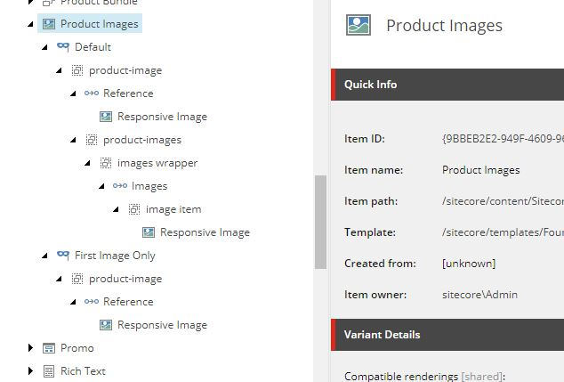

# Using Rendering Variants with Commerce Renderings

**Time to Read:** About 10-15 minutes  
**Intended for:** Sitecore Commerce developers and Sitecore developers  
**Key takeaway:** Most Commerce renderings don't support rendering variants out of the box. This post outlines what you need to know to modify them to work with rendering variants.

Unlike many of the SXA renderings, Commerce renderings don't support rendering variants. There are however two exceptions. Those being Product Bundles and the Product Information Page Content variant. This doesn't offer a lot of flexibility for multiple site instances, especially if each site wants a different look and feel for the product page. We ran into this problem with a recent client that needed the flexibility that rendering variants provided on product pages. In this post I'll go over how we modified the Commerce Catalog renderings to work with rendering variants. Although I'll be focusing on the Catalog renderings you'll be able to use these details on the other Commerce renderings as well.

## Creating new rendering models

For any rendering to work with rendering variants its rendering model needs to inherit `Sitecore.XA.Foundation.Variants.Abstractions.Models.VariantsRenderingModel`. This model includes the `VariantsFields` property which holds the variant definition configured in Sitecore. It's possible you may be able to get by with just implementing this field on your rendering model and populating it yourself. However there are references to the `VariantsRenderingModel` in some of the field renders, so you may loose some functionality if we do it that way. 

What we need to do is update `Sitecore.Commerce.XA.Feature.Catalog.Models.CatalogItemRenderingModel` to inherit `VariantsRenderingModel`. Unfortunately it already inherits it's own base class `BaseCommerceRenderingModel`. We're going to have to recreate it and several other classes to get this to work. Here are the steps I took. You will need a decompiler like dotPeek to reimplement parts of the original Sitecore code.

1) Reimplement `Sitecore.Commerce.XA.Foundation.Common.Models.BaseCommerceRenderingModel` as `BaseCommerceVariantsRenderingModel` inheriting `VariantsRenderingModel` instead
2) Reimplement `Sitecore.Commerce.XA.Feature.Catalog.Models.CatalogItemRenderingModel` as `CatalogItemVariantsRenderingModel` inheriting the new `BaseCommerceVariantsRenderingModel` class.  
    > Another option here is to use pass through properties to the original `CatalogItemRenderingModel` to make upgrading easier. I didn't do that since we made significant updates to the product structure and needed to reimplement much of the model anyway
3) Update ModelProvider to resolve the new model. You will need to create a config patch for this. Example:
``` XML
<commerce.XA>
    <models>
    <CatalogItemVariantsRenderingModel type="Sandbox.Feature.Catalog.Models.CatalogItemVariantsRenderingModel, Sandbox.Feature.Catalog" />
    </models>
</commerce.XA>
```

## Create new BaseCatalogRepository

Now that we have a new rendering model that works with rendering variants, we need a new repository to populate it. Just like the model we'll be using the existing repository as a starting point. We'll be reimplementing `Sitecore.Commerce.XA.Foundation.Common.Repositories.BaseCommerceModelRepository` as `BaseCatalogVariantsRepository`. Much of the code will stay the same as the original, you'll just need to make the following changes.

1) Replace all occurrences of `BaseCommerceRenderingModel` with `BaseCommerceVariantsRenderingModel`
2) Replace all occurrences of `CatalogItemRenderingModel` with `CatalogItemVariantsRenderingModel`
3) Update the `CurrentCatalogItemRenderingModelKeyName` constant to a new value. This will prevent our updates from causing issues with the unmodified renderings
4) You will need to provide a new mock data model that returns the new Rendering Model in the `GetProduct` method
5) Ensure the rendering item `Item` and `PageItem` property are set to the current catalog item. This will allow catalog fields to be used in the rendering variant

## Rendering the view

Now that we have our new base classes in place we need to update the catalog renderings to use them. For this I'll use the Product Images rendering as an example. First we'll need to reimplement the `ProductImagesRepository` to return our new model. This is pretty easy since it just makes a call to `GetProduct` in the base repository. All we need to do is ensure that it inherits the `BaseCatalogVariantsRepository` we just created and a method that returns a `CatalogItemVariantsRenderingModel` via the `GetProduct` method from the base class.

Now we need a new controller action for the rendering to hit and a new cshtml view to render. All it needs to do is call the new `ProductImagesRepository`.

``` C#
public ActionResult ProductImages()
{
    return View(GetRenderingView(nameof(ProductImages)), productImagesRepository.GetProductImagesRenderingModel(visitorContext, null));
}
```

And we need a simple view file to render the variant we'll create in Sitecore. The shell will be the same as the original view, but the content will be replaced with a loop for rendering the Variant Fields

```
<div @Html.Sxa().Component(Model.Rendering.RenderingCssClass ?? "cxa-productimages-component", Model.Attributes)>
    <div class="component-content">
        @if (Model.Item != null)
        {
            foreach (BaseVariantField variantField in Model.VariantFields)
            {
                @Html.RenderingVariants().RenderVariant(variantField, Model.Item, Model.RenderingWebEditingParams, Model)
            }
        }
    </div>
</div>
```

## Putting it all together

Now that we have the backend in place we need to wire it all up in Sitecore. For now we'll just update the out of the box rendering. In practice I highly recommend creating your own version of the rendering through cloning to prevent updates from stepping on our work.

First we need to update the `Controller` field on the Product Images rendering to our new controller. Then we need to include the `/sitecore/templates/Foundation/Experience Accelerator/Variants/Rendering Parameters/IComponentVariant` template to the Product Images Parameters template. This is needed to show the variants dropdown in the Experience Accelerator.

Finally we need to create rendering variants in Sitecore so something actually renders to the page. You can use the original view file as a starting point. Below is an example I created with the default being the out of the box look and an alternate that excludes the thumbnails. What you do here is up to you.



This is just one way to go about this. The downside is that you'll need to modify every rendering you want rendering variant functionality on. Reimplementing the base classes also makes upgrades more difficult if you want to include any new functionality. However rendering variants give the Commerce components the same flexibility that SXA components have. Although this isn't an exhaustive look at how to integrate rendering variants into Commerce renderings, I hope it gives you a good starting point if you decide to implement this in the future.