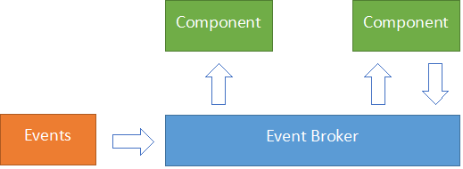

# Understanding the Sitecore Commerce Javascript Architecture

**Time to Read:** About 5-10 minutes  
**Intended for:** Front end developers, Sitecore Commerce developers, and Sitecore developers  
**Key takeaway:** Learn how the Sitecore Commerce renderings interact with each other on the front end.

On a recent Sitecore Commerce project we had the need to extend and add several new Commerce components to support custom functionality. In order to do that we needed to understand how the front end of the existing components are structured. I was tasked with digging into the javascript and sharing the findings with the rest of the team. In this post I will also share what I found with you.

## The Themes
Out of the box Sitecore Commerce provides the following five themes. It's important to understand what these themes contain so you can structure your themes in a similar fashion.

1) **Commerce Core Libraries** - Provides the third party dependencies needed used in the components. This includes knockout with validation, jquery, BrainTree, and Bootstrap
2) **Commerce Core Theme** - This provides the primary application code. This is where the component initialization takes place.
3) **Commerce Main Theme** - This contains a few global utility functions that are useful in component code such as currency formatting and retrieving site details.
4) **Commerce Services Theme** - This theme contains all the code that is shared between components such as the ajax service and event brokers (more on that in a few).
5) **Commerce Components Theme** - This theme contains all the component functionality. This is where you'll be spending most of your time.

## The Event Broker Pattern
Many of the Commerce components need to work together in order to make functional web pages. However the components also don't have any direct knowledge of each other. So they need to communicate without directly referencing other components. This is done using an event broker pattern.



In short components pass an event to a centralized event broker that in turn will notify components that are listing for specific events. These brokers also act as context items that may also store the current state of that specific feature. These all can be found in the **Commerce Services Theme**. The initial brokers provider are:

1) **productselection** - Handles product, variant, or bundle changed events
2) **productprice** - Used to notify components when the product price is set
3) **cart-context** - Used to notify other components that the cart has been updated
4) **messaging** - Handles messages from components that should be displayed to the user

## Components

Overall you will primary be extending the **Commerce Components Theme** when working with commerce components. Most component javascript use the MVVM pattern using KnockoutJS to drive the views. Each component will be split between one or two files. The first being an initializer that's called by **Application.js** in the core theme. The initializer registers events in the broker and will also initialize the the Knockout view model if needed. The second file is the view model driving the Knockout view.

```js
(function (root, factory) {
  'use strict';
  if (typeof define === 'function' && define.amd) {
    // use AMD define funtion to support AMD modules if in use
    define(['exports'], factory);
  } else if (typeof exports === 'object') {
    // to support CommonJS
    factory(exports);
  }

  // browser global variable
  root.ProductPrice = factory;
  root.ProductPrice_ComponentClass = "cxa-productprice-component";
}(this, function (element) {
  'use strict';
  var component = new Component(element);
  component.Name = "CXA/Feature/ProductPrice";
  component.priceInfoVM = null;

  // ProductPriceContext Handlers
  component.ProductPriceSetPriceHandler = function (source, data) {
    component.priceInfoVM.switchInfo(data);
  };

  component.InExperienceEditorMode = function () {
    component.Visual.Disable();
  };

  component.StartListening = function () {
    component.HandlerId = ProductPriceContext.SubscribeHandler(component.ProductPriceSetPriceHandler);
  };

  component.StopListening = function () {
    if (component.HandlerId) {
      ProductPriceContext.UnSubscribeHandler(component.HandlerId);
    }
  };

  component.Init = function () {
    component.priceInfoVM = new PriceInfoViewModel(component.RootElement);
    ko.applyBindingsWithValidation(component.priceInfoVM, this);
    component.Visual.Appear();
    component.StartListening();
  };

  return component;
}));
```
The above is an example of a component initializer. It's taken from the product price component. I won't go into too much detail, but it's important to understand how the initializer gets called. The application code dynamical initializes components when they are found on the page. Components are located by specific data attributes on the root element of the component html.

```html
<div class="cxa-productprice-component" data-cxa-component-class="ProductPrice" data-cxa-component-initialized="false" data-cxa-component-type="component">
```

As you can see the `root.ProductPrice_ComponentClass` property in the initializer matches the class on the component html. The global variable, `root.ProductPrice`, also matches the `data-cxa-component-class` data attribute. This attribute is what is used by the application to call the `Init` function for the component. It finds all elements with the `data-cxa-component-class` attribute and loops through each one to initialize them. It's important to note that if an error occurs in one component the remainder will fail to load due to this.

## Wrapping up
I didn't go into a ton of detail hear, but I hope it's enough to get you started. I encourage you to dig in to the out of the box Commerce Themes to see how all the pieces interact with each other. A good place to start is to look at the product price rendering. It's a simple and small component, but interacts with other components and is easy to follow. 

I hope you have found this post useful. Please feel free to leave a comment if you have any questions.